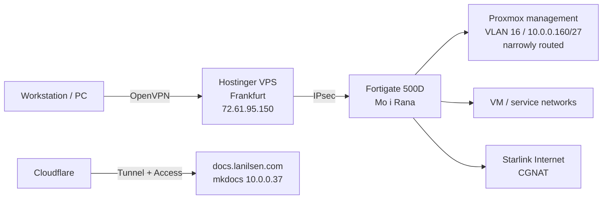
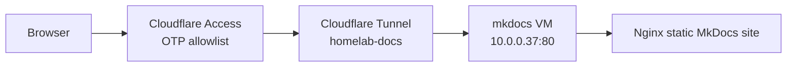

# Architecture

## Current Shape

The homelab sits behind Starlink and CGNAT. External administrative access is anchored through a Hostinger VPS in Frankfurt:



The original Proxmox fallback management network is still on NIC0 at `192.168.13.0/24` and should stay private. Routed automation access now uses VLAN 16, `10.0.0.160/27`, with narrow firewall policy.

## Frankfurt VPS Role

The Hostinger VPS in Germany is a good fit as the public rendezvous point because it has a stable public IP and is outside the Starlink CGNAT boundary.

Good roles for the VPS:

- OpenVPN hub for your workstation.
- IPsec peer toward the Fortigate in Mo i Rana.
- Emergency/break-glass entry point.
- Lightweight external monitoring of public services.
- Public jump point for explicitly allowed admin paths.

Avoid turning the VPS into a broad management bridge. It should not automatically have access to every private management network just because it is convenient.

For Terraform, the VPS is a good runner only when the exact target API is intentionally reachable over the VPN/IPsec path. It can now reach Proxmox through VLAN 16 and can always reach Cloudflare public APIs. Keep the old `192.168.13.0/24` Proxmox fallback network out of broad VPN routing.

## Target Infrastructure

| Layer | Target |
| --- | --- |
| State | Cloudflare R2 remote state, one key per repo/stack |
| Execution | Workstation or Frankfurt VPS with Docker `--network host`; self-hosted runners later if useful |
| Compute | 3 reliable Proxmox nodes on HP DL380 Gen9 |
| Legacy compute | Dell R820 available only for non-critical/lab workloads |
| Storage | Ceph over dedicated 10 Gbit RJ45 network later |
| Firewall | Fortigate 500D managed with Terraform |
| Public ingress | Cloudflare Tunnel plus Cloudflare Access for selected services |
| Docs platform | Self-hosted MkDocs on Ubuntu VM, exposed as `docs.lanilsen.com` |

## Server Inventory

| Host class | Count | CPU | RAM | Local storage | Role |
| --- | ---: | --- | ---: | --- | --- |
| HP ProLiant DL380 Gen9 | 2 | 2x Xeon E5-2667 v4 | 768 GB each | 4 TB NVMe each | Primary Proxmox/Ceph nodes |
| HP ProLiant DL380 Gen9 | 1 | 2x Xeon E5-2687W v3 | 384 GB | 3 TB NVMe | Primary Proxmox/Ceph node |
| Dell R820 | 1 | 4x Xeon E5-4640 | 364 GB DDR3 | 4 TB NVMe | Non-critical only |

## Design Principles

- Keep management, storage, and VM/service traffic separate.
- Keep Terraform state centralized in R2, but do not force Terraform execution into a network path that cannot reach private APIs.
- Use the Fortigate as the policy and routing boundary.
- Keep Cloudflare Tunnel scoped to public applications, not management planes.
- Keep docs as a normal internal service first, then publish externally only through Cloudflare Tunnel and Access.

## Live Service Path



Access is enabled for:

```text
larsj96@gmail.com
jaguni@gmail.com
```
