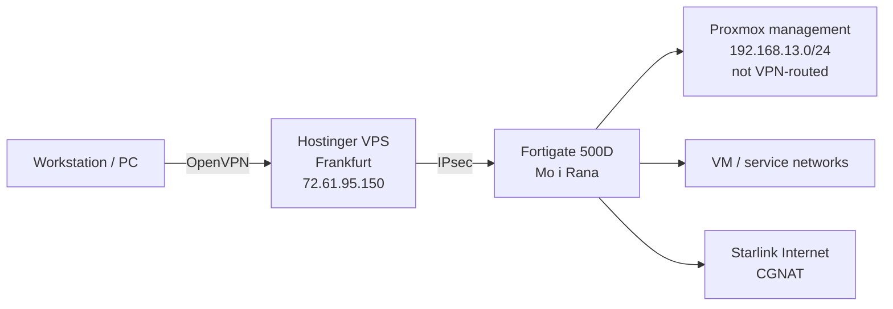

# Architecture

## Current Shape

The homelab sits behind Starlink and CGNAT. External administrative access is anchored through a Hostinger VPS in Frankfurt:

The Proxmox management interface is on NIC0 at 1 Gbit. This network should stay restricted and should not be reachable from the VPN unless a deliberate break-glass route is added.

## Frankfurt VPS Role

The Hostinger VPS in Germany is a good fit as the public rendezvous point because it has a stable public IP and is outside the Starlink CGNAT boundary.

Good roles for the VPS:

- OpenVPN hub for your workstation.
- IPsec peer toward the Fortigate in Mo i Rana.
- Emergency/break-glass entry point.
- Lightweight external monitoring of public services.
- Public jump point for explicitly allowed admin paths.

Avoid turning the VPS into a broad management bridge. It should not automatically have access to every private management network just because it is convenient.

For Terraform, the VPS is only a good runner if the exact target API is intentionally reachable over the VPN/IPsec path. Since Proxmox management on `192.168.13.0/24` is intentionally not reachable from VPN, the VPS should not run Proxmox Terraform unless that policy changes. A Terraform Cloud Agent inside the homelab is cleaner for private infrastructure.

## Target Infrastructure

| Layer | Target |
| --- | --- |
| State | Terraform Cloud remote state |
| Execution | Local workstation first, Terraform Cloud Agent later |
| Compute | 3 reliable Proxmox nodes on HP DL380 Gen9 |
| Legacy compute | Dell R820 available only for non-critical/lab workloads |
| Storage | Ceph over dedicated 10 Gbit RJ45 network later |
| Firewall | Fortigate 500D managed with Terraform |
| Public ingress | Cloudflare Tunnel for selected services |
| Docs platform | Self-hosted highly available Ubuntu VM deployment |

## Server Inventory

| Host class | Count | CPU | RAM | Local storage | Role |
| --- | ---: | --- | ---: | --- | --- |
| HP ProLiant DL380 Gen9 | 2 | 2x Xeon E5-2667 v4 | 768 GB each | 4 TB NVMe each | Primary Proxmox/Ceph nodes |
| HP ProLiant DL380 Gen9 | 1 | 2x Xeon E5-2687W v3 | 384 GB | 3 TB NVMe | Primary Proxmox/Ceph node |
| Dell R820 | 1 | 4x Xeon E5-4640 | 364 GB DDR3 | 4 TB NVMe | Non-critical only |

## Design Principles

- Keep management, storage, and VM/service traffic separate.
- Keep Terraform state centralized, but do not force Terraform execution into a network path that cannot reach private APIs.
- Use the Fortigate as the policy and routing boundary.
- Keep Cloudflare Tunnel scoped to public applications, not management planes.
- Make the docs platform a normal internal service first, then optionally publish it later.
