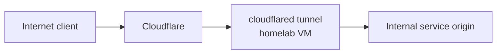

# Cloudflare Tunnel And Plex

## Domain

Owned domain:

- `lanilsen.com`

Terraform can manage Cloudflare DNS, tunnel resources, and access policy.

## Recommended Pattern

Use Cloudflare Tunnel for HTTP-based public services. This works well behind Starlink CGNAT because the tunnel makes outbound connections from the homelab to Cloudflare.

## Plex Note

Plex is special. Cloudflare Tunnel can technically proxy HTTP traffic, but Plex streaming through Cloudflare may conflict with Cloudflare terms or perform poorly depending on traffic pattern and plan. A safer design is:

- Use Cloudflare DNS for a friendly hostname.
- Use Cloudflare Tunnel for Plex management or lightweight access only if acceptable.
- Prefer VPN or Plex's own remote access path for heavy streaming.
- Revisit this before exposing Plex publicly.

## Terraform Scope

Terraform is a good fit for:

- Cloudflare zone settings
- DNS records under `lanilsen.com`
- tunnel resources
- tunnel ingress configuration
- Cloudflare Access policies for admin apps

Keep tunnel credentials secret in Terraform Cloud variables or injected on the cloudflared host.

## Suggested Names

| Resource | Example |
| --- | --- |
| Tunnel | `homelab-mo-i-rana` |
| Docs hostname | `docs.lanilsen.com` |
| Plex hostname | `plex.lanilsen.com` |
| Internal tunnel VM | `cloudflared-01` |

