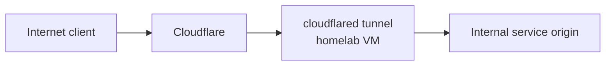

# Cloudflare Tunnel And Plex

## Domain

Owned domain:

- `lanilsen.com`

Terraform can manage Cloudflare DNS, tunnel resources, and access policy.

## Current Implemented Tunnel

Docs are already published through Cloudflare Tunnel:

| Item | Value |
| --- | --- |
| Hostname | `docs.lanilsen.com` |
| Tunnel | `homelab-docs` |
| Tunnel ID | `860588c2-049a-4bd5-8b79-c0e5d822fbac` |
| Origin | `http://10.0.0.37` |
| Access auth domain | `lanilsen.cloudflareaccess.com` |
| Login method | One-time PIN |
| Allowed emails | `larsj96@gmail.com`, `jaguni@gmail.com` |

Terraform stack:

```text
terraform-cloudflare/docs-tunnel
```

## Recommended Pattern

Use Cloudflare Tunnel for HTTP-based public services. This works well behind Starlink CGNAT because the tunnel makes outbound connections from the homelab to Cloudflare.



## Plex Note

Plex is special. Cloudflare Tunnel can technically proxy HTTP traffic, but Plex streaming through Cloudflare may conflict with Cloudflare terms or perform poorly depending on traffic pattern and plan. A safer design is:

- Use Cloudflare DNS for a friendly hostname.
- Use Cloudflare Tunnel for Plex management or lightweight access only after reviewing the traffic/policy fit.
- Prefer VPN or Plex's own remote access path for heavy streaming.
- Revisit this before exposing Plex publicly.

For the broader media stack, publish admin apps such as Sonarr, Radarr, Jackett/Prowlarr, qBittorrent, and Overseerr through Cloudflare Access rather than exposing them directly.

## Terraform Scope

Terraform is a good fit for:

- Cloudflare zone settings
- DNS records under `lanilsen.com`
- tunnel resources
- tunnel ingress configuration
- Cloudflare Access policies for admin apps

Keep tunnel credentials secret in Terraform outputs/env files and inject them on the cloudflared host through Ansible. Do not commit tunnel tokens.

## Suggested Names

| Resource | Example |
| --- | --- |
| Tunnel | `homelab-docs` for docs; service-specific tunnels later if needed |
| Docs hostname | `docs.lanilsen.com` |
| Plex hostname | `plex.lanilsen.com` |
| Internal tunnel VM | currently `mkdocs`; consider a dedicated `cloudflared-01` later for multiple services |

## Access Pattern For Future Services

Use the docs setup as the reference pattern:

1. Terraform creates or updates Cloudflare Tunnel ingress.
2. Terraform creates proxied DNS.
3. Terraform creates a Cloudflare Access application for admin/private apps.
4. Terraform attaches an identity provider, currently One-time PIN.
5. Ansible installs/updates `cloudflared` on the origin or connector host.

For Plex, decide the policy before implementation:

- Cloudflare Access for the management/admin surface.
- VPN or Plex-native remote access for heavy streaming.
- Avoid blindly proxying large media traffic through Cloudflare.
