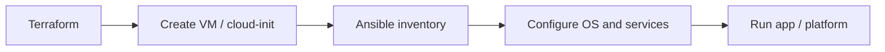

# Infrastructure As Code Operating Model

The homelab should use both Terraform and Ansible.

## Terraform Owns

- Proxmox VMs, templates, pools, tags, and cloud-init inputs
- Fortigate/Palo Alto network objects, VLANs, policies, NAT, and VPN where providers are reliable
- Cloudflare DNS, tunnels, and Access policy
- Terraform Cloud workspaces and variable sets, if desired later

## Ansible Owns

- OS package baseline
- users and SSH authorized keys
- Docker and Compose installation
- cloudflared installation/config
- docs platform deploys
- monitoring agents
- routine Proxmox host checks

## Do Not Force Everything Into One Tool

Terraform is strongest at desired-state APIs and lifecycle management. Ansible is strongest inside machines.

Bad fit examples:

- Managing application config by stuffing long shell scripts into Terraform.
- Creating VMs with Ansible when the Proxmox provider can own lifecycle.
- Making Terraform responsible for emergency Proxmox/Ceph repair.

## Recommended Flow



## First Practical Target

Use Terraform to create two Ubuntu VMs for the docs platform.

Then use Ansible to:

- install Caddy or Nginx
- deploy the static docs build
- configure service health checks
- prepare for internal VIP/load balancing

## Proxmox Image Strategy

Use official Ubuntu cloud images with Proxmox cloud-init. Do not build ISOs or hand-install VMs for normal workloads.

Preferred flow:

```text
Ubuntu cloud image
  -> Proxmox template/download file
  -> Terraform VM clone/create
  -> cloud-init first boot
  -> Ansible service configuration
```

Cloud-init should handle first-boot identity and baseline:

- hostname
- users
- SSH keys
- qemu-guest-agent
- basic packages
- timezone
- DHCP or static network config

Ansible should handle iterative or application-specific state:

- Docker/Compose
- Caddy/Nginx
- cloudflared
- docs platform deploy
- monitoring agents
- app config files

## Existing terraform-proxmox Repo Notes

The old `larsj96/terraform-proxmox` repo was cloned on the Frankfurt VPS at:

```text
/opt/homelab-ops/repos/terraform-proxmox
```

Observed traits:

- Uses `bpg/proxmox` provider.
- Already uses Ubuntu Jammy cloud image download.
- Already uses Proxmox cloud-init snippets.
- Has Terraform Cloud backend for organization `lanilsen`, workspace `proxmox_hjemmelabb`.

Needed modernization before real apply:

- Replace hardcoded endpoint `https://192.168.13.8:8006/` with variable-based `https://10.0.0.162:8006/`.
- Configure provider API token via Terraform Cloud sensitive variables.
- Remove inline default password behavior from cloud-init.
- Move SSH keys into variables or a managed file instead of hardcoding long keys in Terraform.
- Update Ubuntu image target to Noble unless a workload specifically needs Jammy.
- Parameterize node placement instead of hardcoding all VMs to `hp1`.
