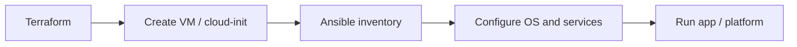
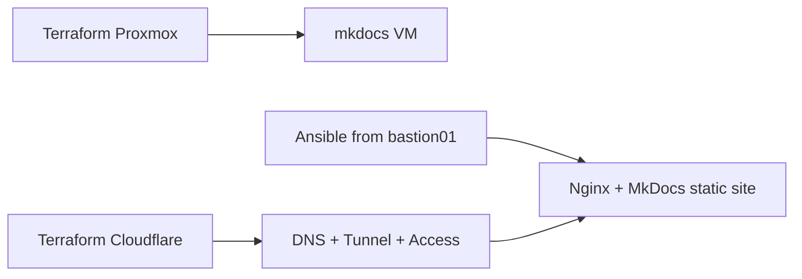

# Infrastructure As Code Operating Model

The homelab should use both Terraform and Ansible.

## Terraform Owns

- Proxmox VMs, templates, pools, tags, and cloud-init inputs
- Fortigate/Palo Alto network objects, VLANs, policies, NAT, and VPN where providers are reliable
- Cloudflare DNS, tunnels, Access applications, and identity providers
- Remote state backend configuration per stack
- Random service credential generation when a stack needs a bootstrap password

## Ansible Owns

- OS package baseline
- users and SSH authorized keys
- Docker and Compose installation
- cloudflared installation/config
- docs platform deploys
- monitoring agents
- routine Proxmox host checks
- reading automation secrets from Vault and writing service `.env` or config files

## Secrets Contract

Generated service credentials should not live in chat, Terraform outputs, or committed files. Use HashiCorp Vault as the automation secret store and Bitwarden/Vaultwarden for human break-glass secrets.

For example, when a future Plex, Grafana, Ombi, Sonarr, or Radarr stack needs an initial password, Terraform should generate it with `random_password`, write it to Vault, and avoid exposing it as a normal output. Ansible then reads the value from Vault when rendering Docker Compose `.env` files.

See [Secrets Management](secrets-management.md).

## Do Not Force Everything Into One Tool

Terraform is strongest at desired-state APIs and lifecycle management. Ansible is strongest inside machines.

Bad fit examples:

- Managing application config by stuffing long shell scripts into Terraform.
- Creating VMs with Ansible when the Proxmox provider can own lifecycle.
- Making Terraform responsible for emergency Proxmox/Ceph repair.

## Recommended Flow



## First Practical Target

The first practical target is complete:

```text
Terraform created bastion01, mkdocs, docker1, and ubuntu-noble-test-01.
Ansible deployed MkDocs/Nginx to mkdocs.
Terraform published docs.lanilsen.com through Cloudflare Tunnel and Cloudflare Access.
```

The current docs flow is:



## Proxmox Image Strategy

Use official Ubuntu cloud images with Proxmox cloud-init. Do not build ISOs or hand-install VMs for normal workloads.

Preferred flow:

```text
Ubuntu cloud image
  -> Proxmox template/download file
  -> Terraform VM clone/create
  -> cloud-init first boot
  -> Ansible service configuration
```

Cloud-init should handle first-boot identity and baseline:

- hostname
- users
- SSH keys
- qemu-guest-agent
- basic packages
- timezone
- DHCP or static network config

Ansible should handle iterative or application-specific state:

- Docker/Compose
- Caddy/Nginx
- cloudflared
- docs platform deploy
- monitoring agents
- app config files

## Existing terraform-proxmox Repo Notes

`larsj96/terraform-proxmox` is cloned on the Frankfurt VPS at:

```text
/opt/homelab-ops/repos/terraform-proxmox
```

Current stack:

```text
proxmox-core/
backend: Cloudflare R2
provider: bpg/proxmox
image: Ubuntu Noble cloud image
primary node: hp1
storage: nvme-local
```

Important implementation notes:

- Run Terraform from the VPS with Docker `--network host`.
- Override Proxmox node SSH address for `hp1` to `10.0.0.162`.
- Put provider tokens and SSH passwords in environment variables or ignored tfvars files.
- Use cloud-init snippets for guest bootstrap.
- Use Ansible for packages and service configuration after the VM exists.

## Current Terraform Stacks

| Stack | Repo/path | State key | Execution |
| --- | --- | --- | --- |
| Proxmox core | `terraform-proxmox/proxmox-core` | `terraform-proxmox/proxmox-core/terraform.tfstate` | VPS/workstation with Proxmox reachability |
| Cloudflare docs | `terraform-cloudflare/docs-tunnel` | `terraform-cloudflare/docs-tunnel/terraform.tfstate` | VPS with Cloudflare/R2 env |
| Fortigate | `terraform-fortigate` | Not migrated yet | Wait until ready |
| Palo Alto | `terraform-palo` | Not migrated yet | Local/lab |

## Current Ansible Roles

| Role | Purpose |
| --- | --- |
| `mkdocs` | Install Nginx, build and publish docs from GitHub. |
| `cloudflared` | Install connector service from Terraform tunnel token. |

Run Ansible from `bastion01` because it has SSH access to service VMs:

```bash
ssh ubuntu@10.0.0.102
cd ~/ansible-homelab
git pull
ansible-playbook playbooks/mkdocs.yml
```
