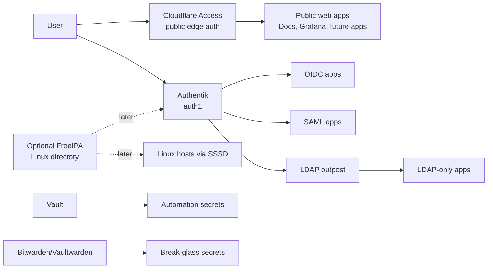

# Identity And SSO

## Decision

Use **Authentik** as the primary homelab identity provider, with **Cloudflare Access** as the public edge gate for selected web apps.

Add **FreeIPA** later only if Linux host identity, Kerberos, LDAP, SSH login policy, or a central directory becomes important enough to justify running it.

Keep local break-glass accounts everywhere. Identity infrastructure must improve security, not make the lab impossible to recover.

## Live Authentik Deployment

`auth1` is the dedicated Authentik VM.

| Item | Value |
| --- | --- |
| VM | `auth1` |
| VMID | `9080` |
| VLAN | `12` / `fortigate_onprem_k8s` |
| IP | `10.0.0.36/27` |
| Internal URL | `http://10.0.0.36:9000` |
| Public URL | `https://auth.lanilsen.com` |
| Deployment | Terraform VM + Ansible Docker Compose |
| Authentik version | `2026.2.2` |

Terraform owns the VM in:

```text
C:\github\terraform-proxmox\proxmox-core\auth1.tf
```

Ansible owns the application stack in:

```text
C:\github\ansible-homelab\playbooks\authentik.yml
C:\github\ansible-homelab\roles\authentik_stack
```

Cloudflare owns the public tunnel/DNS route in:

```text
C:\github\terraform-cloudflare\docs-tunnel
```

`auth.lanilsen.com` is intentionally not protected by Cloudflare Access. It is the identity provider endpoint itself, and SAML clients such as Palo Alto GlobalProtect must be able to reach it before the VPN is connected.

## Why Not FreeIPA Alone

FreeIPA is excellent for LDAP, Kerberos, host enrollment, Linux users, sudo policy, and certificate authority workflows. It is not the best single answer for modern web SSO.

Most web platforms want one of these:

- OIDC
- SAML
- OAuth-style login
- Forward-auth in front of apps that do not support SSO

LDAP gives central usernames, passwords, and groups, but it does not automatically give a clean browser SSO flow with MFA. For that, use Authentik or Keycloak.

In this homelab, Authentik is the better first step because it can speak OIDC/SAML to modern apps, expose LDAP for older apps through an LDAP outpost, and act as a forward-auth layer for tools that have weak or no native SSO.

## Target Layout



## Recommended Service Roles

| Component | Role | Exposure |
| --- | --- | --- |
| Authentik | Primary IdP for OIDC, SAML, LDAP outpost, and forward-auth | Internal first; optionally Cloudflare Access protected |
| Cloudflare Access | Public edge gate for internet-facing web apps | Public HTTPS |
| FreeIPA | Optional future Linux identity/directory backend | Internal only |
| Vault | Automation secrets, tokens, generated app credentials | Internal only |
| Bitwarden/Vaultwarden | Human passwords and break-glass secrets | Internal or carefully protected |

## MFA Standard

Use TOTP first. This works with Google Authenticator, Authy, 1Password, Bitwarden Authenticator, Microsoft Authenticator, and similar apps.

Baseline policy:

- Every VPN-capable user must have TOTP enrolled.
- The VPN group should require MFA before SAML assertion is released to Palo Alto GlobalProtect.
- Admin accounts should use TOTP now and passkeys/WebAuthn later.
- Keep one emergency local firewall/Vault/Proxmox account outside Authentik.

In Authentik this means using an Authenticator Validation stage that allows TOTP and configures missing authenticators instead of silently skipping MFA.

## Compatibility Map

| Platform | Central auth fit | Recommended path | Notes |
| --- | --- | --- | --- |
| Grafana | Good | OIDC with Authentik | Keep local admin for break-glass. Cloudflare Access can also protect the public hostname. |
| Vault | Good | OIDC/JWT or LDAP auth method | Never rely only on SSO. Keep unseal/recovery and root recovery material outside Vault. |
| Proxmox | Good | OIDC realm or LDAP realm | Keep `root@pam` break-glass. Use groups to grant admin/operator roles. |
| Palo Alto | Good | SAML for GlobalProtect/admin, or LDAP/RADIUS | Authentik SAML is the preferred target. RADIUS can be useful if MFA needs a network-auth path. |
| Fortigate | Good | SAML, LDAP, or RADIUS depending feature | Good fit for SSL-VPN/admin auth. Keep a local firewall admin outside SSO. |
| Cloudflare Access | Good | Use Google now, Authentik SAML/OIDC later | Cloudflare can stay the public front door even after Authentik exists. |
| MkDocs/docs | Already good | Cloudflare Access | Current docs are protected with OTP allow-list. |
| Sonarr/Radarr/Prowlarr/Deluge | Mixed | Forward-auth or Cloudflare Access | These apps usually do not have strong native enterprise SSO. Put auth in front of them. |
| Ombi/Overseerr | Better | App-native auth or OIDC if supported | These are friendlier for user-facing media requests. |
| Plex | Limited | Plex account model | Plex does not become normal OIDC/LDAP SSO. Do not proxy heavy Plex streaming through Cloudflare Tunnel. |
| Vaultwarden | Limited | Local accounts and MFA, or official Bitwarden SSO if paid | Vaultwarden is great for human secrets, but do not assume full enterprise SSO. |
| Linux servers | Good | FreeIPA/SSSD later, or Authentik LDAP outpost for simple LDAP | Start with SSH keys/cloud-init; add host identity when the fleet is larger. |

## Terraform And Ansible Model

Identity should be managed like the rest of the lab:

- Terraform can manage Cloudflare Access apps and policies.
- Terraform can manage Vault auth methods, policies, and generated secrets.
- Terraform can manage Authentik configuration through the Authentik provider.
- Ansible can deploy Authentik, configure app files, and restart services.
- Network devices can be managed by Terraform/API where provider support is stable; otherwise use documented CLI/API steps.

Do not store IdP bootstrap passwords, client secrets, or signing keys in Git. Store them in Vault once Vault is available, and keep a recovery copy in Bitwarden/Vaultwarden.

## Implementation Order

1. Deploy `auth1` with Terraform.
2. Run Authentik with Docker Compose, Postgres, and Redis through Ansible.
3. Store Authentik bootstrap credentials and generated client secrets in Vault/Bitwarden.
4. Enable TOTP MFA and create the first VPN user/group.
5. Create an Authentik SAML provider/application for Palo Alto GlobalProtect.
6. Point Palo Alto GlobalProtect SAML at Authentik.
7. Integrate Grafana because it is low-risk and easy to validate.
8. Integrate Proxmox OIDC next, while keeping `root@pam`.
9. Integrate Vault OIDC, while keeping unseal/root recovery outside SSO.
10. Integrate Cloudflare Access with Authentik if we want one identity flow for public apps.
11. Add FreeIPA only if Linux host login, LDAP directory, or Kerberos becomes worth the extra moving parts.

## Friend Onboarding Flow

For Plex/VPN access:

1. Create a named user in Authentik with their real email address.
2. Add them to a limited group such as `vpn-plex-users`.
3. Force password change at first login.
4. Require TOTP enrollment during first login.
5. Give them the GlobalProtect portal hostname.
6. Confirm they can connect from mobile data.
7. Confirm they can reach Plex and only the networks/services intended for that group.
8. Disable the user when access is no longer needed.

Do not share a common VPN user. Every friend gets a personal account, personal MFA, and can be disabled independently.

## Break-Glass Rules

Keep these independent from SSO:

- Proxmox `root@pam`.
- Palo Alto local admin.
- Fortigate local admin.
- Vault unseal/recovery material.
- Cloudflare account recovery.
- R2 backend recovery credentials.
- One documented path to reach the lab if the IdP is down.

The IdP should be highly available eventually, but at the current lab stage it is more important to have a clear manual recovery path than to pretend identity is already production-grade HA.
