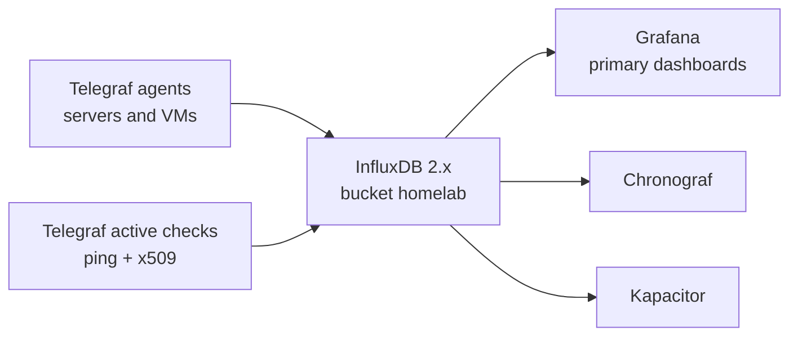
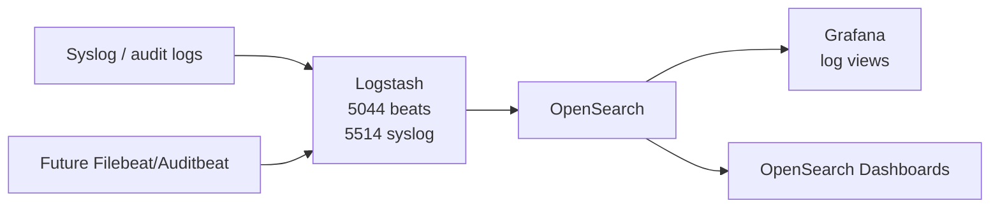

# Monitoring Platform

## Goal

Build a central monitoring platform that is managed like the rest of the homelab:

- Terraform creates the monitoring VM.
- cloud-init gives it the standard Ubuntu baseline and SSH keys.
- Ansible installs Docker and deploys the monitoring stack.
- Ansible installs Telegraf on monitored servers.
- Metrics go to InfluxDB.
- Grafana is the primary dashboard front end.
- Syslog/audit/application logs go to OpenSearch through Logstash.

## Target VM

Terraform stack:

```text
terraform-proxmox/proxmox-core
```

Planned VM:

| VM | VMID | VLAN | Purpose | Size |
| --- | ---: | ---: | --- | --- |
| `monitoring1` | `9040` | `12` | Central monitoring stack | 8 CPU, 32 GiB RAM, 500 GiB disk |

The VM should live on the services VLAN with the other app VMs:

```text
VLAN 12 / fortigate_onprem_k8s
CIDR 10.0.0.32/27
gateway 10.0.0.33
```

Initial inventory placeholder:

```text
monitoring1 ansible_host=10.0.0.38 ansible_user=ubuntu
```

Adjust the inventory if Fortigate DHCP assigns a different reservation.

## Metrics Pipeline



Telegraf should be installed on all normal Terraform-created Ubuntu VMs through Ansible:

```text
[telegraf_agents]
bastion01
mkdocs01
docker1
monitoring1
```

When a new Terraform VM is added, add it to `telegraf_agents` after the first boot. That keeps the VM onboarding flow simple:

1. Terraform creates the VM with cloud-init and SSH keys.
2. Fortigate DHCP reservation gives the VM a stable IP.
3. Add the host to Ansible inventory.
4. Run `ansible-playbook playbooks/monitoring.yml`.

## Active Remote Checks

The central Telegraf container on `monitoring1` runs active checks:

| Check | Purpose |
| --- | --- |
| `inputs.ping` | Gateway, key VMs, Proxmox management, internet reachability. |
| `inputs.x509_cert` | Certificate expiry and TLS health for public/internal HTTPS endpoints. |

Initial targets:

```text
10.0.0.1
10.0.0.33
10.0.0.37
10.0.0.99
10.0.0.162
1.1.1.1
https://docs.lanilsen.com:443
https://10.0.0.162:8006
```

## Logs Pipeline

ELK here means the log/audit pipeline, not metrics.

Use OpenSearch instead of Elastic licensing-sensitive packages for the first Docker-based version:



Initial exposed ports on `monitoring1`:

| Port | Service |
| ---: | --- |
| `8086` | InfluxDB |
| `8888` | Chronograf |
| `3000` | Grafana |
| `9092` | Kapacitor |
| `9200` | OpenSearch API |
| `5601` | OpenSearch Dashboards |
| `5044` | Beats input |
| `5514/tcp+udp` | Syslog input |

Restrict these ports with Fortigate policy. Do not expose dashboards publicly without Cloudflare Access or VPN.

## Ansible Layout

Repo:

```text
larsj96/Ansible
```

New roles/playbook:

```text
roles/docker_host/
roles/monitoring_stack/
roles/telegraf_agent/
playbooks/monitoring.yml
```

Run from `bastion01`:

```bash
cd ~/ansible-homelab
git pull
ansible-playbook playbooks/monitoring.yml
```

Secrets needed before first deploy:

```text
influxdb_admin_password
influxdb_admin_token
opensearch_initial_admin_password
grafana_admin_password
```

Store them in Ansible Vault or another ignored secret file, not in Git.

## Terraform And Cloud-Init Contract

Terraform should continue using the shared Noble cloud-init snippet:

```text
qemu-guest-agent
curl
ca-certificates
timezone Europe/Oslo
workstation SSH key
bastion SSH key
```

Do not pack full monitoring configuration into cloud-init. Keep cloud-init as the bootstrap layer and let Ansible own installed services.

## Next Steps

1. Apply Terraform for `monitoring1`.
2. Confirm Fortigate DHCP IP and update Ansible inventory if not `10.0.0.38`.
3. Create Ansible secret values.
4. Deploy `playbooks/monitoring.yml`.
5. Add Filebeat/Auditbeat or syslog forwarding after metrics are stable.
6. Decide whether dashboards should stay VPN-only or be protected by Cloudflare Access.

## Grafana Public Access Option

Grafana should be the friendly front door for dashboards. Keep it internal first:

```text
http://10.0.0.38:3000
```

When ready, expose it the same way as docs:

```text
grafana.lanilsen.com
  -> Cloudflare Access
  -> Cloudflare Tunnel
  -> http://10.0.0.38:3000
```

Use Cloudflare Access for edge authentication, then keep Grafana's own admin password strong for local or VPN access.
