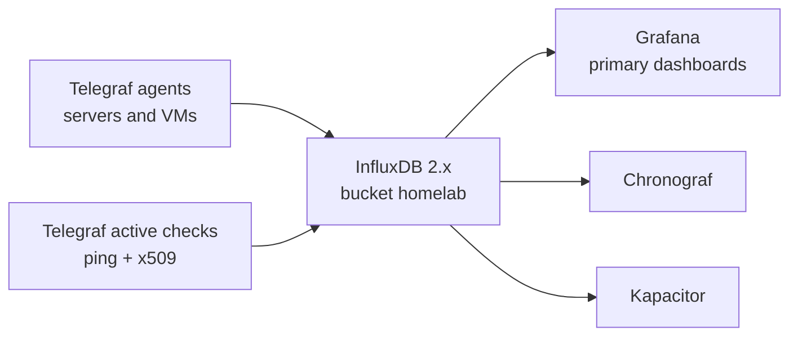
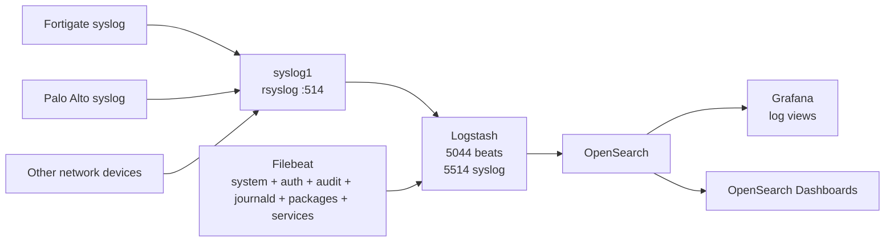

# Monitoring Platform

## Goal

Build a central monitoring platform that is managed like the rest of the homelab:

- Terraform creates the monitoring VM.
- cloud-init gives it the standard Ubuntu baseline and SSH keys.
- Ansible installs Docker and deploys the monitoring stack.
- Ansible installs Telegraf on monitored servers.
- Ansible installs Filebeat on the same host group for centralized system/audit/service log shipping.
- A dedicated syslog forwarder receives firewall/network syslog and relays it to Logstash.
- Metrics go to InfluxDB.
- Grafana is the primary dashboard front end.
- Syslog/audit/application logs go to OpenSearch through Logstash.

## Target VM

Terraform stack:

```text
terraform-proxmox/proxmox-core
```

Live VM:

| VM | VMID | VLAN | Purpose | Size |
| --- | ---: | ---: | --- | --- |
| `monitoring1` | `9040` | `12` | Central monitoring stack | 8 CPU, 32 GiB RAM, 500 GiB disk |
| `syslog1` | `9090` | `12` | Syslog forwarder for Fortigate/Palo/network devices | 2 CPU, 4 GiB RAM, 80 GiB disk |

The VM should live on the services VLAN with the other app VMs:

```text
VLAN 12 / fortigate_onprem_k8s
CIDR 10.0.0.32/27
gateway 10.0.0.33
```

Current inventory:

```text
monitoring1 ansible_host=10.0.0.38 ansible_user=ubuntu
syslog1 ansible_host=10.0.0.40 ansible_user=ubuntu
```

Fortigate DHCP assigned `10.0.0.38`, and the QEMU guest agent reports that address.

## Metrics Pipeline



Telegraf should be installed on all normal Terraform-created Ubuntu VMs through Ansible:

```text
[telegraf_agents]
bastion01
mkdocs01
docker1
monitoring1
media1
```

When a new Terraform VM is added, add it to `telegraf_agents` after the first boot. That keeps the VM onboarding flow simple:

1. Terraform creates the VM with cloud-init and SSH keys.
2. Fortigate DHCP reservation gives the VM a stable IP.
3. Add the host to Ansible inventory.
4. Run `ansible-playbook playbooks/monitoring.yml`.

`log_shipper_agents` is a child group of `telegraf_agents`, so all hosts in that host list receive Filebeat by default.

## Active Remote Checks

The central Telegraf container on `monitoring1` runs active checks:

| Check | Purpose |
| --- | --- |
| `inputs.ping` | Gateway, key VMs, Proxmox management, internet reachability. |
| `inputs.x509_cert` | Certificate expiry and TLS health for public/internal HTTPS endpoints. |

Initial targets:

```text
10.0.0.1
10.0.0.33
10.0.0.35
10.0.0.102
10.0.0.161
10.0.0.162
10.0.0.163
10.0.0.164
10.0.0.165
10.0.124.165
10.0.124.166
10.0.124.167
1.1.1.1
https://docs.lanilsen.com:443
https://10.0.0.162:8006
https://10.0.124.165:443
https://10.0.124.166:443
https://10.0.124.167:443
```

## Network Device Monitoring

`monitoring1` is also the collector host for infrastructure devices:

| Device class | Current targets | Current method |
| --- | --- | --- |
| Proxmox management | `10.0.0.162`, `10.0.0.163`, `10.0.0.164`, `10.0.0.165` | Ping, Proxmox web certificate check on `10.0.0.162` |
| HP iLO | `10.0.124.165`, `10.0.124.166`, `10.0.124.167` | Ping and HTTPS certificate checks |
| Fortigate | `10.0.0.33`, `10.0.0.161` | Ping |
| Palo Alto | `10.1.1.3` | SNMPv2 polling through Telegraf |

SNMP is enabled for confirmed device targets:

```yaml
monitoring_snmp_enabled: true
monitoring_snmp_community: "{{ snmp_community | default('') }}"
```

The community belongs in the ignored `group_vars/monitoring_secrets.yml`. After changing targets or secrets, rerun:

```bash
ansible-playbook playbooks/monitoring.yml
```

Palo Alto SNMP was fixed on `2026-05-22` by enabling the management-plane SNMP service and moving Telegraf from the stale `10.1.1.65` target to `10.1.1.3`. Live samples now include `PanSystem` fields such as `UpTime`, `PanSysSwVersion`, `PanSessionActiveTcp`, interface descriptions/status, fan values, and CPU load fields.

## Cloudflare Metrics

Cloudflare can be added as an extra data source in the same stack by running a Prometheus-style exporter next to Telegraf and scraping it into InfluxDB.

The implementation in this repo uses the [lablabs/cloudflare-exporter](https://github.com/lablabs/cloudflare-exporter):

- In `docker-compose.yml`, Ansible creates `cloudflare-exporter` when `monitoring_cloudflare_enabled: true`.
- Telegraf adds a `[[inputs.prometheus]]` scrape on `http://cloudflare-exporter:{{ monitoring_cloudflare_container_port }}/metrics`.
- Scraped metrics are written by Telegraf into the existing InfluxDB bucket (`homelab` by default).
- Grafana gets a provisioning template at `roles/monitoring_stack/templates/grafana-dashboard-cloudflare.json.j2`.

This design keeps your current stack intact (InfluxDB + Grafana) and avoids introducing a separate Prometheus installation.

### Enabling it

In `group_vars/monitoring.yml`:

```yaml
monitoring_cloudflare_enabled: true
monitoring_cloudflare_accounts:
  - "ACCOUNT_ID-1"
monitoring_cloudflare_zones:
  - "ZONE_ID-1"
monitoring_cloudflare_excluded_zones: []
```

In `group_vars/monitoring_secrets.yml` (vault-managed), set:

```text
cloudflare_api_token: "<token-with-analytics-permissions>"
```

Then deploy:

```bash
ansible-playbook playbooks/monitoring.yml --ask-vault-pass
```

### Token scopes

The exporter documentation requires these minimum permissions for broad zone data:

- `Zone / Analytics:Read`
- `Account / Account Analytics:Read` (if you enable account-level metrics)

Optional scopes are required for optional metric families:

- `Zone / Firewall Services:Read` (to enrich firewall metrics names)
- `Account / Account Settings:Read` (required for listing accessible accounts when worker/account metrics are enabled)
- Any additional Cloudflare product permissions your selected dashboard requires (Workers, Load Balancing, API Gateway, etc.).

For Free zones, GraphQL analytics visibility is reduced:

- Only a subset of metrics are available; the exporter marks skipped zones with `cloudflare_zones_skipped_free_tier`.

### Collection approach and alternatives

This stack uses `lablabs/cloudflare-exporter`, which is a maintained open-source Prometheus exporter backed by Cloudflare GraphQL + REST APIs.

An alternative is Cloudflare's official Worker-based exporter (`cloudflare-prometheus-exporter`), which is also supported by Cloudflare docs and pushes data in Prometheus format.

Both fit the same scrape pattern (`/metrics` to Telegraf -> InfluxDB -> Grafana), so the dashboard/provisioning layer can stay the same if you later swap collectors.

The first SNMP collection uses generic `SNMPv2-MIB` and `IF-MIB` data: system name, uptime, interface names, interface status, and in/out octets. Later we can add richer device-specific collection with HP iLO Redfish/IPMI exporter, Fortigate SNMP OIDs, or a Prometheus exporter if we want deeper dashboards.

## Logs Pipeline

ELK here means the log/audit pipeline, not metrics.

Use OpenSearch instead of Elastic licensing-sensitive packages for the first Docker-based version:



Live exposed ports on `monitoring1`:

| Port | Service |
| ---: | --- |
| `8086` | InfluxDB |
| `8888` | Chronograf |
| `3000` | Grafana |
| `9092` | Kapacitor |
| `9200` | OpenSearch API |
| `5601` | OpenSearch Dashboards |
| `5044` | Beats input |
| `5514/tcp+udp` | Syslog input |

Live exposed ports on `syslog1`:

| Port | Service |
| ---: | --- |
| `514/udp` | Firewall/network syslog receive |
| `514/tcp` | Firewall/network syslog receive |

`syslog1` writes a local copy under:

```text
/var/log/remote/<sender-ip>/YYYY-MM-DD.log
```

It also forwards to Logstash on `monitoring1:5514/tcp` with a disk-backed rsyslog queue, so short Logstash/OpenSearch restarts should not lose firewall logs.

Current operational note:

- `syslog1` VMID `9090` exists in Proxmox with planned IP `10.0.0.40`, but it did not answer SSH/ping after first boot.
- Until that VM is fixed or recreated, Fortigate is temporarily sending syslog directly to `monitoring1:5514/udp`.
- Logstash is already listening on `5514/tcp+udp`, so this temporary path is valid and verified.

Restrict these ports with Fortigate policy. Do not expose dashboards publicly without Cloudflare Access or VPN.

### Linux VM Log Coverage

The `log_shipper` role installs Filebeat, `auditd`, and `rsyslog` on every host in `log_shipper_agents`.

Default shipped sources:

| Source | Examples |
| --- | --- |
| Journald | systemd units, service starts/stops, kernel-adjacent runtime logs |
| System logs | `/var/log/syslog`, `/var/log/auth.log`, daemon/user/cron logs |
| Audit logs | `/var/log/audit/audit.log` |
| Kernel logs | `/var/log/kern.log` |
| Package logs | `dpkg`, `apt`, unattended-upgrades |
| Cloud-init logs | `/var/log/cloud-init.log`, `/var/log/cloud-init-output.log` |
| Service logs | Nginx logs and Docker container JSON logs when present |

Indexes:

| Index pattern | Purpose |
| --- | --- |
| `homelab-filebeat-*` | Linux VM logs from Filebeat |
| `homelab-fortigate-*` | Fortigate syslog parsed as key-value data where possible |
| `homelab-paloalto-*` | Palo Alto syslog tagged for firewall/VPN troubleshooting |
| `homelab-syslog-*` | Generic network syslog |

### Firewall Syslog Targets

Configure firewalls to send syslog to:

```text
syslog1.mgmt.nilsen-tech.com
10.0.0.40
UDP/514 or TCP/514
```

Temporary live Fortigate target:

```text
10.0.0.38
UDP/5514
format CEF
```

Recommended Fortigate coverage:

- traffic logs for key policies
- event/system logs
- VPN/IKE/IPsec events
- admin login/config-change events
- security events/threat logs where licensed/enabled

Recommended Palo Alto coverage:

- system logs
- traffic logs for GlobalProtect/VPN and inter-site tunnel policies
- threat logs
- config logs
- GlobalProtect logs
- HIP/auth logs if enabled later

Palo Alto status as of `2026-05-24`:

- Vsys syslog server profile `homelab-opensearch` exists on the PA-510 and points at `10.0.0.38:5514/udp`.
- Vsys log forwarding profile `homelab-opensearch` forwards traffic, threat, URL, and WildFire logs to that syslog profile.
- Shared syslog server profile `homelab-opensearch-shared` exists for system/config/GlobalProtect log settings and also points at `10.0.0.38:5514/udp`.
- The important security policies have `log-setting = homelab-opensearch` and log at session end enabled.
- Commit job `149` completed successfully.
- This is captured in Terraform at `terraform-palo/live/homelab/network-base/logging.tf` using the PAN-OS XML API pattern because the standalone PA-510 needs direct vsys/shared XPaths for this logging layout.

Verification on `2026-05-24`:

| Source | Index | Result |
| --- | --- | --- |
| Ubuntu VMs via Filebeat | `homelab-filebeat-*` | Confirmed |
| Fortigate CEF syslog | `homelab-fortigate-*` | Confirmed |
| Generic network syslog | `homelab-syslog-*` | Confirmed |
| Palo Alto traffic/system syslog | `homelab-paloalto-*` | Confirmed |

Fortigate classifier note: Fortigate CEF events can contain tunnel names such as `palo-ipv6`. The Logstash classifier must identify Fortigate by hostname `FGT*` or `CEF:0|Fortinet|Fortigate|` before checking Palo Alto keywords, otherwise Fortigate VPN events can be misindexed as Palo Alto.

## Tunnel Throughput Baseline

On `2026-05-24`, a short `iperf3` baseline was run from WSL on the Palo-side workstation to `mkdocs01` (`10.0.0.37`) over the Palo-to-Fortigate direct IPv6 IPsec tunnel.

| Test | Result | Retransmits |
| --- | ---: | ---: |
| TCP, 4 streams, WSL -> homelab | ~9.1 Mbit/s sender / ~8.7 Mbit/s receiver | 78 |
| TCP, 4 streams, reverse | ~6.9 Mbit/s sender / ~6.8 Mbit/s receiver | 139 |
| TCP, 1 stream, WSL -> homelab | ~5.9 Mbit/s sender / ~5.8 Mbit/s receiver | 12 |
| TCP, 1 stream, reverse | ~7.4 Mbit/s sender / ~7.2 Mbit/s receiver | 8 |

Ping to `10.0.0.37` during the same check:

```text
min/avg/max = 93.6/116.9/178.9 ms
packet loss = 0%
```

This is much lower than expected for a healthy Starlink-to-Starlink VPN path. Treat it as a baseline before tuning MTU/MSS, IPsec offload, Starlink path quality, and WSL effects.

## Ansible Layout

Repo:

```text
larsj96/Ansible
```

New roles/playbook:

```text
roles/docker_host/
roles/monitoring_stack/
roles/telegraf_agent/
roles/log_shipper/
roles/syslog_forwarder/
playbooks/monitoring.yml
playbooks/syslog-forwarder.yml
```

Run from `bastion01`:

```bash
cd ~/ansible-homelab
git pull
ansible-playbook playbooks/monitoring.yml
```

Secrets are stored on `bastion01` in the ignored file:

```text
~/ansible-homelab/group_vars/monitoring_secrets.yml
```

Do not commit this file. It contains:

```text
influxdb_admin_password
influxdb_admin_token
opensearch_initial_admin_password
grafana_admin_password
```

Keep this file encrypted with Ansible Vault; share generated access secrets only through Vaultwarden as needed.

## Terraform And Cloud-Init Contract

Terraform should continue using the shared Noble cloud-init snippet:

```text
qemu-guest-agent
curl
ca-certificates
timezone Europe/Oslo
workstation SSH key
bastion SSH key
```

Do not pack full monitoring configuration into cloud-init. Keep cloud-init as the bootstrap layer and let Ansible own installed services.

## Next Steps

1. Add Grafana data sources and first dashboards.
2. Expand Filebeat parsing coverage as more host services are added (Docker, SSH, nginx, etc.).
3. Point Fortigate, Proxmox, and key Linux syslog toward `10.0.0.38:5514`.
4. Decide whether dashboards should stay VPN-only or be protected by Cloudflare Access.
5. Add the Dell iDRAC management IP when confirmed.
6. Add richer SNMP/Redfish/IPMI dashboards after device SNMP is enabled.

## Deployment Status

Deployed on `2026-05-21`:

| Component | Status |
| --- | --- |
| Terraform VM `monitoring1` | Created and running |
| Cloud-init snippet | Uploaded to `local:snippets/terraform-noble-base-cloud-config.yaml` |
| Docker monitoring stack | Running |
| InfluxDB health | HTTP `200` locally |
| Grafana login | HTTP `200` locally |
| OpenSearch API | HTTP `200` locally |
| OpenSearch Dashboards | HTTP `302` locally |
| Telegraf on `bastion01` | Active |
| Telegraf on `mkdocs01` | Active |
| Telegraf on `docker1` | Active |
| Telegraf on `monitoring1` | Active |
| Telegraf on `media1` | Active |
| Grafana InfluxDB datasource | Provisioned |
| Grafana OpenSearch datasource | Provisioned |
| iLO/Fortigate/Proxmox active checks | Configured on central Telegraf |
| SNMP collection | Active for confirmed iLO, Fortigate, and Palo Alto targets |
| Filebeat log shipping | Active on current Ubuntu VM inventory |
| Fortigate syslog | Verified into `homelab-fortigate-*` |
| Palo Alto syslog/log forwarding | Verified into `homelab-paloalto-*` |

## Grafana Public Access Option

Grafana should be the friendly front door for dashboards. Keep it internal first:

```text
http://10.0.0.38:3000
```

When ready, expose it the same way as docs:

```text
grafana.lanilsen.com
  -> Cloudflare Access
  -> Cloudflare Tunnel
  -> http://10.0.0.38:3000
```

Use Cloudflare Access for edge authentication, then keep Grafana's own admin password strong for local or VPN access.
