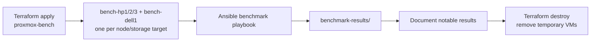

# Proxmox Benchmarking

## Goal

Create a repeatable way to measure VM performance across Proxmox nodes and local NVMe storage targets before and after storage/network changes.

This is especially useful before building Ceph. A known baseline on local NVMe makes later Ceph tests much more meaningful.

## Stack Layout

Terraform stack:

```text
terraform-proxmox/proxmox-bench
```

Ansible playbook:

```text
Ansible/playbooks/benchmarks.yml
```

Default temporary VMs:

| VM | Proxmox node | Storage | VMID | CPU | RAM | Disk |
| --- | --- | --- | ---: | ---: | ---: | ---: |
| `bench-hp1` | `hp1` | `nvme-local` | 9301 | 4 cores | 8 GiB | 100 GiB |
| `bench-hp2` | `hp2` | `nvme-local` | 9302 | 4 cores | 8 GiB | 100 GiB |
| `bench-hp3` | `hp3` | `nvme-local` | 9303 | 4 cores | 8 GiB | 100 GiB |
| `bench-dell1` | `dell1` | `nvme-dell` | 9304 | 4 cores | 8 GiB | 100 GiB |

The VMs are disposable. They should be destroyed after each benchmark run unless you are actively comparing several runs.

Prerequisite:

```text
local:iso/ubuntu-24.04-server-cloudimg-amd64.img
```

The image must exist on each target node. The benchmark stack does not own this image file because repeated temporary test runs should not fight Proxmox files that already exist.

Storage model:

| Storage ID | Nodes | Backing storage | Notes |
| --- | --- | --- | --- |
| `nvme-local` | `hp1`, `hp2`, `hp3` | Local NVMe LVM-thin pool on each HP node | Same storage ID, but the actual disk is local to the selected node. This is the main HP baseline before Ceph. |
| `nvme-dell` | `dell1` | Dell local NVMe-backed storage | Useful for comparison, but keep Dell results separate because the server is not considered reliable long-term. |

## Run Model



## Benchmark Tests

The Ansible role installs:

- `fio`
- `sysbench`
- `stress-ng`
- `iperf3`
- `jq`

Default test profile:

| Test | Default |
| --- | --- |
| CPU | `sysbench cpu` for 180 seconds using all vCPUs |
| Memory | `sysbench memory` for 120 seconds using all vCPUs |
| Sequential read | `fio`, 1 MiB block size, 4 jobs, iodepth 32, 180 seconds |
| Sequential write | `fio`, 1 MiB block size, 4 jobs, iodepth 32, 180 seconds |
| Random read | `fio`, 4 KiB block size, 4 jobs, iodepth 32, 180 seconds |
| Random write | `fio`, 4 KiB block size, 4 jobs, iodepth 32, 180 seconds |
| Mixed random | `fio`, 4 KiB block size, 70 percent read, 180 seconds |

This is intentionally heavier than a smoke test. For quick validation, override the runtimes.

## Commands

From the Frankfurt VPS:

```bash
cd /opt/homelab-ops/repos/terraform-proxmox/proxmox-bench
cp backend.r2.tfbackend.example backend.r2.tfbackend
terraform init -backend-config=backend.r2.tfbackend
terraform apply
```

After DHCP addresses are known, create an inventory from the example:

```bash
cd ~/ansible-homelab
cp inventory/benchmarks.ini.example inventory/benchmarks.ini
```

Then run from a host that can SSH to the benchmark VMs:

```bash
ansible-playbook -i inventory/benchmarks.ini playbooks/benchmarks.yml
```

Quick smoke test:

```bash
ansible-playbook -i inventory/benchmarks.ini playbooks/benchmarks.yml \
  -e benchmark_cpu_seconds=20 \
  -e benchmark_memory_seconds=20 \
  -e benchmark_fio_runtime=30 \
  -e benchmark_fio_size=2G
```

Cleanup:

```bash
cd /opt/homelab-ops/repos/terraform-proxmox/proxmox-bench
terraform destroy
```

## Result Storage

The role fetches a compressed result archive per VM into:

```text
benchmark-results/<run_id>/<host>/<host-archive>.tgz
```

Each archive contains:

- `host.json`
- `sysbench-cpu.txt`
- `sysbench-memory.txt`
- `fio-*.json`

Do not commit raw benchmark results unless there is a specific reason. Summarize important runs in this document or in a dedicated dated run note.

## Notes

- Use the same VM size when comparing nodes.
- Record the storage ID with every result. Slow or worn storage should be removed from the future placement pool instead of hidden behind an average.
- Keep the same storage ID (`nvme-local`) when comparing HP nodes.
- Keep `nvme-dell` results separate from HP results.
- Re-run this before and after Ceph so the difference is measured, not guessed.
- If a benchmark VM gets a new DHCP address, update only `inventory/benchmarks.ini`; the Terraform stack should stay reusable.

## Run Log

### 2026-05-22 hp-nvme-baseline-01

Purpose: first baseline for HP nodes on local `nvme-local` before Ceph work.

Terraform:

- Stack: `terraform-proxmox/proxmox-bench`
- State key: `terraform-proxmox/proxmox-bench/terraform.tfstate`
- VMs: `bench-hp1`, `bench-hp2`, `bench-hp3`
- VLAN: 12
- Disk: 100 GiB per VM on `nvme-local`

Runtime overrides:

```text
benchmark_cpu_seconds=60
benchmark_memory_seconds=60
benchmark_fio_runtime=60
benchmark_fio_size=4G
```

Observed DHCP:

| VM | Node | IP |
| --- | --- | --- |
| `bench-hp1` | `hp1` | `10.0.0.41` |
| `bench-hp2` | `hp2` | `10.0.0.43` |
| `bench-hp3` | `hp3` | `10.0.0.42` |

Results:

| Host | Node | vCPU | RAM MB | CPU eps | Mem MiB/s | Seq read MiB/s | Seq write MiB/s | 4k rand read IOPS | 4k rand write IOPS | 70/30 read IOPS | 70/30 write IOPS |
| --- | --- | ---: | ---: | ---: | ---: | ---: | ---: | ---: | ---: | ---: | ---: |
| `bench-hp1` | `hp1` | 4 | 7941 | 4622 | 3367 | 2991 | 741 | 166336 | 82464 | 109546 | 46964 |
| `bench-hp2` | `hp2` | 4 | 7941 | 4273 | 696 | 1242 | 635 | 175694 | 76835 | 109198 | 46813 |
| `bench-hp3` | `hp3` | 4 | 7941 | 4767 | 3083 | 837 | 766 | 201457 | 162873 | 138788 | 59488 |

Notes from the first run:

- `hp1` had the strongest sequential read result in this run.
- `hp3` had the strongest random write and mixed random result in this run.
- `hp2` memory throughput looked unusually low compared with the other two nodes, so repeat this test before treating that as a durable finding.
- The first apply hit Proxmox API task-status timeouts on `hp2`/`hp3`; the VMs existed and were imported/reconciled into Terraform state before rerunning apply.
- The first Ansible collection exposed a role bug where fio work files were archived before cleanup. The role now removes fio work files before creating the result archive.
