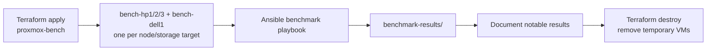

# Proxmox Benchmarking

## Goal

Create a repeatable way to measure VM performance across Proxmox nodes and local NVMe storage targets before and after storage/network changes.

This is especially useful before building Ceph. A known baseline on local NVMe makes later Ceph tests much more meaningful.

## Stack Layout

Terraform stack:

```text
terraform-proxmox/proxmox-bench
```

Ansible playbook:

```text
Ansible/playbooks/benchmarks.yml
```

Default temporary VMs:

| VM | Proxmox node | Storage | VMID | CPU | RAM | Disk |
| --- | --- | --- | ---: | ---: | ---: | ---: |
| `bench-hp1` | `hp1` | `nvme-local` | 9301 | 4 cores | 8 GiB | 100 GiB |
| `bench-hp2` | `hp2` | `nvme-local` | 9302 | 4 cores | 8 GiB | 100 GiB |
| `bench-hp3` | `hp3` | `nvme-local` | 9303 | 4 cores | 8 GiB | 100 GiB |
| `bench-hp3-sas` | `hp3` | `sas-hp3` | 9304 | 4 cores | 8 GiB | 100 GiB |
| `bench-dell1` | `dell1` | `nvme-dell` | 9305 | 4 cores | 8 GiB | 100 GiB |

The VMs are disposable. They should be destroyed after each benchmark run unless you are actively comparing several runs.

The live default map deploys the three HP targets. Dell is documented and kept in `benchmark-vms-with-dell.tfvars.example`, but should only be enabled when Dell is rejoined cleanly or managed as its own standalone Proxmox target. Current state observed from the APIs: the HP cluster does not list `dell1`, and Dell's own API reports an unhealthy/unknown node view.

Prerequisite:

```text
nvme-files:iso/noble-server-cloudimg-amd64.img
```

The image must exist on each HP target node. Do not source benchmark VMs from Proxmox `local` storage on the HP nodes; `local` is backed by the Proxmox boot USB and makes VM import timing meaningless.

`nvme-files` is a small local directory storage on each HP node, backed by the node-local NVMe VG. It stores cloud images/snippets/templates used to create temporary benchmark VMs without touching USB-backed `local`.

Storage model:

| Storage ID | Nodes | Backing storage | Notes |
| --- | --- | --- | --- |
| `nvme-local` | `hp1`, `hp2`, `hp3` | Local NVMe LVM-thin pool on each HP node | Same storage ID, but the actual disk is local to the selected node. This is the main HP baseline before Ceph. |
| `nvme-files` | `hp1`, `hp2`, `hp3` | Local NVMe directory storage on each HP node | Cloud image/snippet source for benchmark VM creation. Not used for VM disks. |
| `sas-hp3` | `hp3` | HP Smart Array 4.9 TB SAS logical volume, LVM-thin | Useful for comparing hp3 SAS capacity storage against hp3 NVMe local storage. |
| `nvme-dell` | `dell1` | Dell local NVMe-backed storage | Useful for comparison, but keep Dell results separate because the server is not considered reliable long-term. |

## Run Model



## Benchmark Tests

The Ansible role installs:

- `fio`
- `sysbench`
- `stress-ng`
- `iperf3`
- `jq`

Default test profile:

| Test | Default |
| --- | --- |
| CPU | `sysbench cpu` for 180 seconds using all vCPUs |
| Memory | `sysbench memory` for 120 seconds using all vCPUs |
| Sequential read | `fio`, 1 MiB block size, 4 jobs, iodepth 32, 180 seconds |
| Sequential write | `fio`, 1 MiB block size, 4 jobs, iodepth 32, 180 seconds |
| Random read | `fio`, 4 KiB block size, 4 jobs, iodepth 32, 180 seconds |
| Random write | `fio`, 4 KiB block size, 4 jobs, iodepth 32, 180 seconds |
| Mixed random | `fio`, 4 KiB block size, 70 percent read, 180 seconds |
| Network | `iperf3` client to the selected `iperf_servers` inventory host |

This is intentionally heavier than a smoke test. For quick validation, override the runtimes.

## Commands

From the Frankfurt VPS:

```bash
cd /opt/homelab-ops/repos/terraform-proxmox/proxmox-bench
cp backend.r2.tfbackend.example backend.r2.tfbackend
terraform init -backend-config=backend.r2.tfbackend
terraform apply
```

After DHCP addresses are known, create an inventory from the example:

```bash
cd ~/ansible-homelab
cp inventory/benchmarks.ini.example inventory/benchmarks.ini
```

Then run from a host that can SSH to the benchmark VMs:

```bash
ansible-playbook -i inventory/benchmarks.ini playbooks/benchmarks.yml
```

The benchmark inventory can include an iperf server host:

```ini
[iperf_servers]
bench-hp1
```

The role starts one persistent `iperf3` daemon on that inventory host, runs client tests from every other benchmark VM, stores `iperf3.json` in each client archive, then stops the daemon.

The Frankfurt VPS is also prepared as a persistent WAN/VPN iperf target:

| Host | Service | Port | Notes |
| --- | --- | ---: | --- |
| `72.61.95.150` | `iperf3-server.service` | `5201/tcp` | Installed with systemd on `2026-05-22`; useful for VM-to-VPS and VPN-path baselines. |

Use it without asking Ansible to manage the VPS-side process:

```bash
ansible-playbook -i inventory/benchmarks.ini playbooks/benchmarks.yml \
  -e benchmark_iperf_host=72.61.95.150 \
  -e benchmark_iperf_manage_server=false
```

VPS service checks:

```bash
ssh root@72.61.95.150 'systemctl status iperf3-server --no-pager'
ssh root@72.61.95.150 'ss -lntp | grep :5201'
```

Quick smoke test:

```bash
ansible-playbook -i inventory/benchmarks.ini playbooks/benchmarks.yml \
  -e benchmark_cpu_seconds=20 \
  -e benchmark_memory_seconds=20 \
  -e benchmark_fio_runtime=30 \
  -e benchmark_fio_size=2G
```

Cleanup:

```bash
cd /opt/homelab-ops/repos/terraform-proxmox/proxmox-bench
terraform destroy
```

## Result Storage

The role fetches a compressed result archive per VM into:

```text
benchmark-results/<run_id>/<host>/<host-archive>.tgz
```

Each archive contains:

- `host.json`
- `sysbench-cpu.txt`
- `sysbench-memory.txt`
- `fio-*.json`
- `iperf3.json` when an iperf server is configured

Do not commit raw benchmark results unless there is a specific reason. Summarize important runs in this document or in a dedicated dated run note.

## Notes

- Use the same VM size when comparing nodes.
- Record the storage ID with every result. Slow or worn storage should be removed from the future placement pool instead of hidden behind an average.
- Keep the same storage ID (`nvme-local`) when comparing HP nodes.
- Keep `nvme-dell` results separate from HP results.
- Re-run this before and after Ceph so the difference is measured, not guessed.
- If a benchmark VM gets a new DHCP address, update only `inventory/benchmarks.ini`; the Terraform stack should stay reusable.

## Run Log

### 2026-05-22 hp-nvme-baseline-01

Purpose: first baseline for HP nodes on local `nvme-local` before Ceph work.

Terraform:

- Stack: `terraform-proxmox/proxmox-bench`
- State key: `terraform-proxmox/proxmox-bench/terraform.tfstate`
- VMs: `bench-hp1`, `bench-hp2`, `bench-hp3`
- VLAN: 12
- Disk: 100 GiB per VM on `nvme-local`

Runtime overrides:

```text
benchmark_cpu_seconds=60
benchmark_memory_seconds=60
benchmark_fio_runtime=60
benchmark_fio_size=4G
```

Observed DHCP:

| VM | Node | IP |
| --- | --- | --- |
| `bench-hp1` | `hp1` | `10.0.0.41` |
| `bench-hp2` | `hp2` | `10.0.0.43` |
| `bench-hp3` | `hp3` | `10.0.0.42` |

Results:

| Host | Node | vCPU | RAM MB | CPU eps | Mem MiB/s | Seq read MiB/s | Seq write MiB/s | 4k rand read IOPS | 4k rand write IOPS | 70/30 read IOPS | 70/30 write IOPS |
| --- | --- | ---: | ---: | ---: | ---: | ---: | ---: | ---: | ---: | ---: | ---: |
| `bench-hp1` | `hp1` | 4 | 7941 | 4622 | 3367 | 2991 | 741 | 166336 | 82464 | 109546 | 46964 |
| `bench-hp2` | `hp2` | 4 | 7941 | 4273 | 696 | 1242 | 635 | 175694 | 76835 | 109198 | 46813 |
| `bench-hp3` | `hp3` | 4 | 7941 | 4767 | 3083 | 837 | 766 | 201457 | 162873 | 138788 | 59488 |

Notes from the first run:

- `hp1` had the strongest sequential read result in this run.
- `hp3` had the strongest random write and mixed random result in this run.
- `hp2` memory throughput looked unusually low compared with the other two nodes, so repeat this test before treating that as a durable finding.
- The first apply hit Proxmox API task-status timeouts on `hp2`/`hp3`; the VMs existed and were imported/reconciled into Terraform state before rerunning apply.
- The first Ansible collection exposed a role bug where fio work files were archived before cleanup. The role now removes fio work files before creating the result archive.

### 2026-05-22 all-storage-iperf-02

Purpose: compare the healthy HP local NVMe pools, the hp3 SAS capacity pool, and basic VM network throughput with `iperf3`.

Terraform:

- Stack: `terraform-proxmox/proxmox-bench`
- State key: `terraform-proxmox/proxmox-bench/terraform.tfstate`
- VMs: `bench-hp1`, `bench-hp2`, `bench-hp3`, `bench-hp3-sas`
- VLAN: 12
- Disk: 100 GiB per VM
- Storage: `nvme-local` for HP NVMe VMs, `sas-hp3` for the hp3 SAS VM

Storage tested:

| Storage ID | Node | Backing storage |
| --- | --- | --- |
| `nvme-local` | `hp1` | HP local NVMe LVM-thin pool |
| `nvme-local` | `hp2` | HP local NVMe LVM-thin pool |
| `nvme-local` | `hp3` | HP local NVMe LVM-thin pool |
| `sas-hp3` | `hp3` | 4.9 TB SAS logical volume, LVM-thin |

Runtime overrides:

```text
benchmark_cpu_seconds=60
benchmark_memory_seconds=60
benchmark_fio_runtime=60
benchmark_fio_size=4G
iperf server=bench-hp1
```

Observed DHCP:

| VM | Node | Storage | IP |
| --- | --- | --- | --- |
| `bench-hp1` | `hp1` | `nvme-local` | `10.0.0.42` |
| `bench-hp2` | `hp2` | `nvme-local` | `10.0.0.43` |
| `bench-hp3` | `hp3` | `nvme-local` | `10.0.0.41` |
| `bench-hp3-sas` | `hp3` | `sas-hp3` | `10.0.0.44` |

Results:

| Host | Node | Storage | CPU eps | Mem MiB/s | iperf to hp1 Mbit/s | Seq read MiB/s | Seq write MiB/s | 4k rand read IOPS | 4k rand write IOPS | 70/30 read IOPS | 70/30 write IOPS |
| --- | --- | --- | ---: | ---: | ---: | ---: | ---: | ---: | ---: | ---: | ---: |
| `bench-hp1` | `hp1` | `nvme-local` | 4623 | 3579 | server | 3022 | 884 | 167006 | 74025 | 114034 | 48887 |
| `bench-hp2` | `hp2` | `nvme-local` | 4325 | 765 | 939 | 1444 | 689 | 155186 | 71662 | 110684 | 47452 |
| `bench-hp3` | `hp3` | `nvme-local` | 4721 | 7231 | 939 | 837 | 765 | 202817 | 152103 | 136264 | 58412 |
| `bench-hp3-sas` | `hp3` | `sas-hp3` | 4722 | 9766 | 938 | 1516 | 221 | 7164 | 1245 | 2316 | 1001 |

Notes from this run:

- `iperf3` between the benchmark VMs landed around 938-939 Mbit/s, which matches the current 1 Gbit path expectation.
- `bench-hp3-sas` had much lower random and mixed-random IOPS than the NVMe-backed VMs. That is expected for SAS capacity storage and confirms it should not be treated like fast VM storage.
- `bench-hp3-sas` took much longer to clone/import than the NVMe-backed VMs, which is another practical signal for placement decisions.
- `bench-hp2` again showed unusually low memory throughput compared with the other VMs. Treat this as something to investigate or rerun before making a hardware conclusion.
- The first `iperf3` implementation tried parallel clients against one server and failed for some hosts because iperf3 only runs one test at a time. The role now serializes iperf clients.

### 2026-05-23 HP host power/profile inspection

Purpose: follow up on the low `bench-hp2` memory result from `2026-05-22 all-storage-iperf-02`.

Checked from the Frankfurt VPS against `hp1`, `hp2`, and `hp3` over SSH. Linux-visible CPU policy looked sane on all three nodes, but iLO exposed an actual platform difference.

| Host | CPU | Threads | Linux governor | Turbo | BIOS | Memory population/speed | Initial iLO power regulator | Final iLO power regulator |
| --- | --- | ---: | --- | --- | --- | --- | --- | --- |
| `hp1` | 2x Xeon E5-2667 v4 | 32 | `performance` | enabled | P89, 2019-10-21 | 12x32G, 2400 MT/s configured | `dynamic` | `max` |
| `hp2` | 2x Xeon E5-2687W v3 | 40 | `performance` | enabled | P89, 2019-10-21 | 24x32G, 1866 MT/s configured | `dynamic` | `max` |
| `hp3` | 2x Xeon E5-2667 v4 | 32 | `performance` | enabled | P89, 2018-05-21 | 24x32G, reported 1600 MT/s configured | `max` | `max` |

iLO power readings after alignment:

| Host | Present power | Average power | Max observed | Server max power | PSU status |
| --- | ---: | ---: | ---: | ---: | --- |
| `hp1` | 119 W | 118 W | 245 W | 457 W | PSU1 input lost, PSU2 good/in use |
| `hp2` | 104 W | 102 W | 260 W | 617 W | PSU1 input lost, PSU2 good/in use |
| `hp3` | 141 W | 144 W | 566 W | 599 W | PSU1 input lost, PSU2 good/in use |

Actions taken:

- Set `hp1` and `hp2` iLO power regulator to `max` so all HP nodes match the fastest observed host profile.
- Verified all three iLOs respond to SNMPv2 from `monitoring1`.
- Fixed `hp1` iLO SNMP, which had been restricted to an old source IP. `ilo-hp1`, `ilo-hp2`, and `ilo-hp3` now appear in Influx as iLO devices.
- Updated Ansible monitoring targets so the iLO dashboard can collect all three HP servers.

Findings:

- Linux-visible CPU governor was already `performance` on all three HP nodes.
- Intel turbo was enabled on all three nodes: `intel_pstate_no_turbo=0`.
- No obvious kernel log evidence of CPU throttling, MCE, or corrected/uncorrected memory errors was found in the checked boot logs.
- `hp2` is not hardware-identical to `hp1`/`hp3`: it has E5-2687W v3 CPUs, 40 threads, and 24 populated DIMMs running at 1866 MT/s.
- The earlier low sysbench memory result may still be a VM NUMA placement or benchmark artifact, but the iLO power-regulator mismatch was real and has now been removed from the comparison.

Next checks if the low hp2 memory score repeats:

1. Re-run the benchmark after the iLO power-regulator alignment.
2. Re-run with explicit VM NUMA settings and CPU type pinned consistently.
3. Run a host-level memory benchmark package on each node during a quiet window to separate host memory behavior from VM/NUMA behavior.
4. Feed the PSU1 input-lost status into alerting so missing redundant power does not become invisible.

### 2026-05-23 storage source fix

Purpose: remove the USB boot disk from the benchmark VM creation path.

Problem found:

- The benchmark docs and Terraform default still pointed at `local:iso/ubuntu-24.04-server-cloudimg-amd64.img`.
- On the HP nodes, `local` is `/var/lib/vz` on the Proxmox boot USB.
- That made clone/import timing noisy and could make SAS or NVMe look worse for the wrong reason.

Fix implemented:

- Created `nvme-files` on `hp1`, `hp2`, and `hp3` as local NVMe-backed directory storage.
- Copied the Noble cloud image to `nvme-files:iso/noble-server-cloudimg-amd64.img` on each HP node.
- Updated `terraform-proxmox/proxmox-bench` defaults:
  - `snippets_storage = "nvme-files"`
  - `ubuntu_cloud_image_file_id = "nvme-files:iso/noble-server-cloudimg-amd64.img"`
- Updated benchmark cloud-init so the custom `cicustom` snippet includes the workstation and bastion SSH keys directly.

Operational note:

- The three NVMe benchmark VMs recreated quickly from `nvme-files`.
- `bench-hp3-sas` still took about 22 minutes to import/start because the VM disk itself lives on `sas-hp3`. That is a real storage placement signal, not a USB-source artifact.

### 2026-05-23 after-ilo-power-nvme-01

Purpose: rerun the HP NVMe benchmark after aligning HP iLO power regulator settings to `max`.

Runtime overrides:

```text
benchmark_cpu_seconds=180
benchmark_memory_seconds=120
benchmark_fio_runtime=180
benchmark_fio_size=8G
iperf server=bench-hp1
```

Observed DHCP:

| VM | Node | Storage | IP |
| --- | --- | --- | --- |
| `bench-hp1` | `hp1` | `nvme-local` | `10.0.0.45` |
| `bench-hp2` | `hp2` | `nvme-local` | `10.0.0.44` |
| `bench-hp3` | `hp3` | `nvme-local` | `10.0.0.43` |

Results:

| Host | Node | Storage | CPU eps | Mem MiB/s | iperf to hp1 Mbit/s | Seq read MiB/s | Seq write MiB/s | 4k rand read IOPS | 4k rand write IOPS | 70/30 read IOPS | 70/30 write IOPS |
| --- | --- | --- | ---: | ---: | ---: | ---: | ---: | ---: | ---: | ---: | ---: |
| `bench-hp1` | `hp1` | `nvme-local` | 4683 | 3478 | server | 2971 | 825 | 204434 | 162921 | 129737 | 55578 |
| `bench-hp2` | `hp2` | `nvme-local` | 4241 | 735 | 939 | 1009 | 566 | 190670 | 142801 | 128250 | 54941 |
| `bench-hp3` | `hp3` | `nvme-local` | 4743 | 3039 | 939 | 837 | 764 | 204148 | 152096 | 131031 | 56137 |

Findings:

- The iLO power-regulator mismatch was not the whole hp2 story. `hp2` still shows unusually low sysbench memory throughput.
- `hp2` random disk performance is now close to the other HP nodes, so the earlier disk suspicion is less interesting than memory/NUMA/CPU-generation differences.
- `hp1` still has the strongest sequential NVMe read behavior in this test.

### 2026-05-23 hp3-sas-after-nvme-files-01

Purpose: compare hp3 SAS capacity storage against hp3 NVMe after fixing the image source to `nvme-files`.

Observed DHCP:

| VM | Node | Storage | IP |
| --- | --- | --- | --- |
| `bench-hp3-sas` | `hp3` | `sas-hp3` | `10.0.0.46` |

Results:

| Host | Node | Storage | CPU eps | Mem MiB/s | iperf to hp1 Mbit/s | Seq read MiB/s | Seq write MiB/s | 4k rand read IOPS | 4k rand write IOPS | 70/30 read IOPS | 70/30 write IOPS |
| --- | --- | --- | ---: | ---: | ---: | ---: | ---: | ---: | ---: | ---: | ---: |
| `bench-hp3` | `hp3` | `nvme-local` | 4743 | 3039 | 941 | 837 | 764 | 204148 | 152096 | 131031 | 56137 |
| `bench-hp3-sas` | `hp3` | `sas-hp3` | 4747 | 3201 | 941 | 1475 | 241 | 6548 | 1280 | 2268 | 974 |

Findings:

- `sas-hp3` sequential read is decent for capacity storage in this run, but write and random IO are far below NVMe.
- Random 4k write on SAS is roughly two orders of magnitude lower than hp3 NVMe in this VM test.
- `sas-hp3` is appropriate for media/capacity workloads, but not for latency-sensitive VM disks, databases, or anything that should feel fast.
- Terraform successfully created the SAS VM into state, but the provider timed out while starting it after the long import. The VM was then started manually and benchmarked cleanly.

### 2026-05-23 iLO thermal check

Purpose: investigate the Grafana panel where `ilo-hp3` `sensor_index=20` in `power-zone` looked much hotter than the other HP servers.

Influx latest readings during the benchmark window:

| Device | Sensor | Location | Celsius |
| --- | ---: | --- | ---: |
| `ilo-hp1` | 20 | `power-zone` | 40 |
| `ilo-hp2` | 20 | `power-zone` | 40 |
| `ilo-hp3` | 20 | `power-zone` | 40 |

Current hottest sensors:

| Device | Sensor | Location | Celsius |
| --- | ---: | --- | ---: |
| `ilo-hp1` | 27 | `disk-backplane` | 55 |
| `ilo-hp2` | 27 | `disk-backplane` | 58 |
| `ilo-hp3` | 27 | `disk-backplane` | 52 |
| `ilo-hp3` | 8 | `system-board` | 50 |

Power draw:

| Device | Active PSU used watts |
| --- | ---: |
| `ilo-hp1` | 121 |
| `ilo-hp2` | 106 |
| `ilo-hp3` | 162 |

Interpretation:

- `ilo-hp3` sensor 20 is not currently hotter than the same sensor on hp1/hp2.
- hp3 is drawing more power right now, which is expected while it hosts media/SAS/benchmark work.
- The hottest reported HP sensors are disk-backplane sensors, with hp2 currently highest at 58C.
- Add alerting around high disk-backplane temperature and PSU redundancy loss before relying on these systems for heavier storage work.
