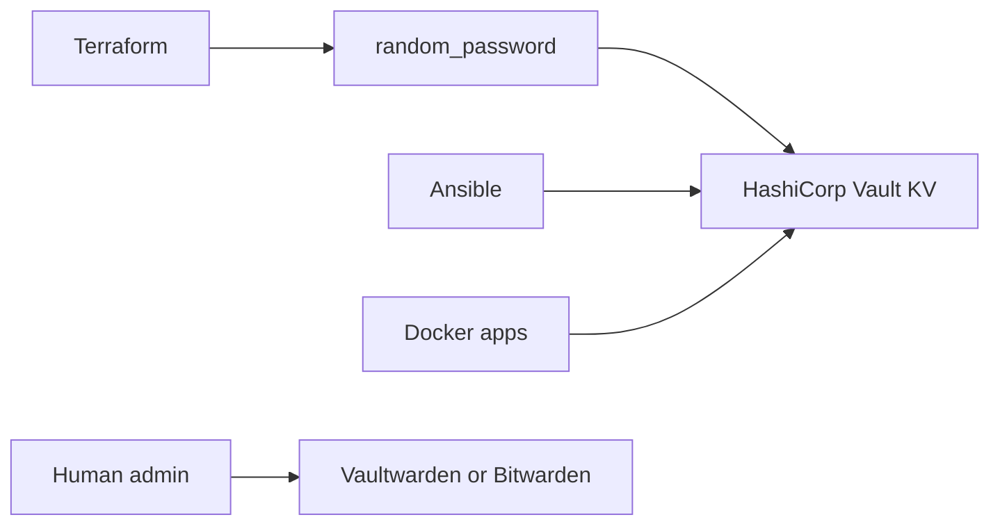

# Secrets Management

## Decision

Use two layers:

- **HashiCorp Vault** for automation secrets.
- **Bitwarden or Vaultwarden** for human passwords and break-glass access.

Vault is the right default for Terraform and Ansible because it has a stable API and Terraform provider. Vaultwarden is excellent for humans using browser/mobile clients, but it is not the best source of truth for infrastructure-generated secrets.

## Target Layout



## What Goes Where

| Secret type | Store | Notes |
| --- | --- | --- |
| Grafana admin password | Vault | Generated by Terraform or rotated by Ansible, then read during deployment. |
| InfluxDB admin token/password | Vault | Automation-owned service secret. |
| OpenSearch admin password | Vault | Automation-owned service secret. |
| Plex/Ombi/Sonarr/Radarr initial app passwords | Vault | Store generated bootstrap values and document app-specific reset procedure. |
| Proxmox/Fortigate/Palo Alto emergency login | Bitwarden/Vaultwarden | Human break-glass only. Do not feed broad admin passwords into pipelines unless needed. |
| Cloudflare/Fortigate/Palo/PVE API tokens | Vault for automation, Bitwarden for break-glass copy | Prefer scoped tokens per stack. |
| SSH private keys | Avoid in Terraform state | Prefer host-local keys, agent forwarding, or Vault only when a workflow explicitly needs key material. |

## Terraform Pattern

For new services, Terraform should generate strong random passwords and store them in Vault. The service module should not print passwords in outputs.

Example pattern:

```hcl
resource "random_password" "grafana_admin" {
  length  = 32
  special = true
}

resource "vault_kv_secret_v2" "grafana_admin" {
  mount = "homelab"
  name  = "monitoring/grafana"

  data_json = jsonencode({
    username = "admin"
    password = random_password.grafana_admin.result
  })
}
```

Ansible can then read the secret during deployment and write `.env` files or app config on the target VM.

## Docker Hosting

Vault can run on `docker1` first as a Docker Compose service, but it must be treated as critical infrastructure:

- Persist Vault data on durable storage.
- Back up the Vault data directory and unseal/recovery material.
- Keep unseal/recovery keys in Bitwarden/Vaultwarden, not only in the lab.
- Protect the UI/API with Cloudflare Access or VPN-only policy.
- Use TLS, even internally.

For lab momentum, start with a single Vault container on `docker1`. Later, move it to a dedicated `secrets1` VM or highly available storage if it becomes a dependency for bootstrapping everything else.

## Bootstrap Rule

Do not make the whole homelab impossible to recover if Vault is down.

Keep these outside Vault as break-glass material:

- Vault recovery/unseal keys.
- One Proxmox emergency admin path.
- One firewall emergency admin path.
- R2 backend credentials or a recovery copy.
- A documented restore procedure.

## VM Onboarding Contract

When Terraform creates a VM or app stack:

1. Terraform creates the VM and cloud-init baseline.
2. Terraform or Ansible creates any random app credentials.
3. Automation writes generated credentials to Vault.
4. Ansible configures the service by reading from Vault.
5. Human-facing emergency credentials are copied to Bitwarden/Vaultwarden only when needed.

This keeps generated service passwords out of Git, Terraform outputs, chat logs, and random shell history.
