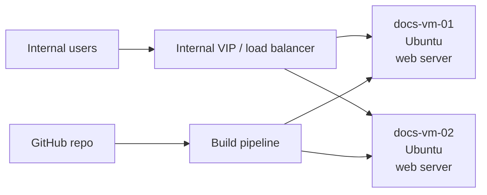

# Self-Hosted Docs Platform

## Source

Existing docs source:

- `larsj96/az-static-web-app-docs`
- Current docs path: `docs/`

The goal is to self-host this in the homelab on Ubuntu VMs with high availability.

## Recommended v1 Architecture

For a first reliable version, keep the app static:

- Build the docs into static HTML.
- Serve with Nginx or Caddy on two Ubuntu VMs.
- Put a small load balancer or VIP in front.
- Store source of truth in Git.

## HA Options

| Option | Complexity | Notes |
| --- | --- | --- |
| Caddy/Nginx on two VMs plus keepalived VIP | Low | Good homelab fit. |
| HAProxy VM pair plus web VMs | Medium | Better if many services will share load balancing. |
| Kubernetes | High | Useful later, not required for static docs. |

## Deployment Pattern

Recommended v1:

1. Terraform creates two Ubuntu VMs in Proxmox.
2. cloud-init installs baseline packages and SSH access.
3. Ansible or a CI job installs Nginx/Caddy and deploys the built static site.
4. A VIP or internal DNS record points users to the active service.

Keep Terraform responsible for infrastructure. Let a config/deploy tool handle OS and app deployment.

## Publishing Later

If the docs should become externally reachable, publish through Cloudflare Tunnel rather than opening inbound firewall ports through Starlink/CGNAT.

