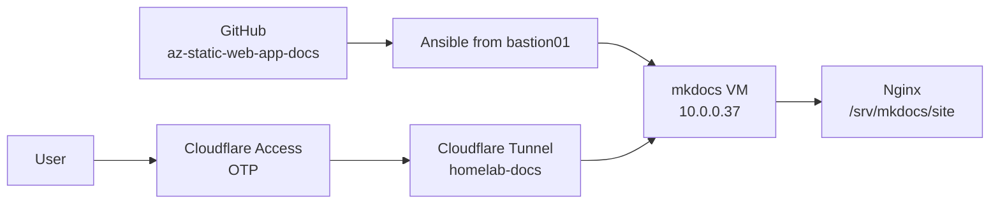

# Self-Hosted Docs Platform

## Current Live Platform

The docs platform is now self-hosted in the homelab and published online.

| Component | Current value |
| --- | --- |
| Public URL | `https://docs.lanilsen.com/` |
| Public protection | Cloudflare Access with One-time PIN |
| Allowed emails | `larsj96@gmail.com`, `jaguni@gmail.com` |
| Origin VM | `mkdocs`, VMID `9020` |
| Origin IP | `10.0.0.37` on VLAN 12 / `fortigate_onprem_k8s` |
| Web server | Nginx serving static MkDocs output |
| Control host | `bastion01`, `10.0.0.99` |
| Source repo | `larsj96/az-static-web-app-docs` |
| Deploy repo | `larsj96/Ansible` |
| Public ingress repo | `larsj96/terraform_cloudfare` |

## Source Of Truth

Docs source:

- `larsj96/az-static-web-app-docs`
- Current docs path: `docs/`

Ansible role:

```text
roles/mkdocs/
playbooks/mkdocs.yml
```

The role installs Nginx, creates a Python virtual environment, installs MkDocs and plugins, builds static HTML, and serves it from:

```text
/srv/mkdocs/site
```

## Current Architecture



Terraform creates the VM and Cloudflare resources. Ansible configures the operating system and publishes the docs.

## Terraform Resources

Proxmox stack:

```text
terraform-proxmox/proxmox-core
resource: proxmox_virtual_environment_vm.mkdocs
VMID: 9020
CPU: 2
RAM: 4096 MiB
Disk: 64 GiB
Network: VLAN 12
```

Cloudflare stack:

```text
terraform-cloudflare/docs-tunnel
state key: terraform-cloudflare/docs-tunnel/terraform.tfstate
```

Managed Cloudflare resources:

```text
cloudflare_zero_trust_tunnel_cloudflared.docs
cloudflare_zero_trust_tunnel_cloudflared_config.docs
cloudflare_dns_record.docs
cloudflare_zero_trust_access_application.docs
cloudflare_zero_trust_access_identity_provider.onetimepin
```

Live IDs:

```text
Tunnel: homelab-docs
Tunnel ID: 860588c2-049a-4bd5-8b79-c0e5d822fbac
Zone ID: e3aca4623d7fcdc887ecfe460106e11e
Access app ID: 0b794d55-b193-49d0-a9b1-b71096ce5e0b
Access IdP ID: e4b9d0c2-e559-43d1-9328-7571c493cd2b
```

## Deployment

Run from `bastion01`:

```bash
cd ~/ansible-homelab
git pull
ansible-playbook playbooks/mkdocs.yml
```

The public endpoint should redirect unauthenticated users to Cloudflare Access:

```bash
curl -I https://docs.lanilsen.com/
```

Expected:

```text
HTTP/2 302
location: https://lanilsen.cloudflareaccess.com/...
```

The login page should contain an email field for the One-time PIN flow.

## HA Options Still Open

| Option | Complexity | Notes |
| --- | --- | --- |
| Current single VM | Low | Good enough while content is static and easy to redeploy. |
| Caddy/Nginx on two VMs plus keepalived VIP | Low | Good next HA step. |
| HAProxy VM pair plus web VMs | Medium | Better if many services will share load balancing. |
| Kubernetes | High | Useful later, not required for static docs. |

## Next Improvements

- Add a second docs VM and either a VIP or Cloudflare tunnel load balancing/failover later.
- Add a GitHub Actions or VPS runner deploy flow if manual Ansible runs become annoying.
- Keep Cloudflare Access in front of the public hostname.
- Narrow the Cloudflare API token after bootstrap.
