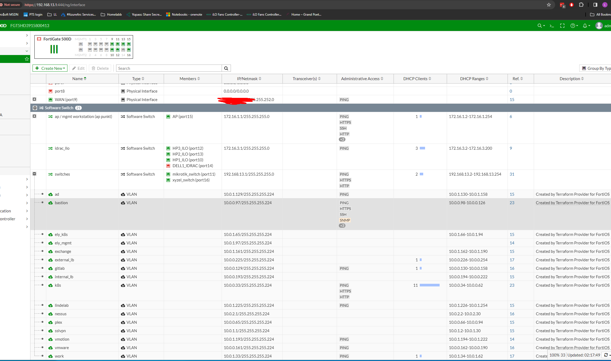

## Terraform code block

```

locals {
  # If we allocate two addressing bits to regions and
  # three addressing bits to subnett then we can have
  # up to four regions and up to eight subnett, with
  # each zone then requiring five subnet addressing
  # bits in total.
  regions = {
    fortigate_onprem_ = 0 
    azure_north_eu_   = 1
    # number 3 available for future expansion
  }
  subnett = {
    k8s         = 1
    plex        = 2
    bastion     = 3
    gitlab      = 4
    vmware      = 5
    internal_lb = 6
    external_lb = 7
    sslvpn      = 8
    work        = 9
    ely_k8s    = 10
    ely_mgmt   = 11
    ad         = 12
    exchange   = 13
    vmotion    = 14
    lindelab   = 15
    nessus     = 16
  }

  base_cidr_block = "10.0.0.0/16"
  region_blocks = {
    for name, num in local.regions : name => {
      cidr_block = cidrsubnet(local.base_cidr_block, 4, num)
    }
  }
  subnetts_block = {
    for name, region_num in local.regions : name => {
      for letter, num in local.subnett : "${name}${letter}" => {
        cidr_block = cidrsubnet(local.region_blocks[name].cidr_block, 7, num)
        vlanid     = "${01}${num + 1}"
      }
    }
  }

}


resource "fortios_system_interface" "vlan_cidr_calc" {
  for_each = local.subnetts_block.fortigate_onprem_

  defaultgw = "enable"
  ip        = "${cidrhost("${each.value.cidr_block}", 1)}${" "}${cidrnetmask("${each.value.cidr_block}")}"

  vlanid = each.value.vlanid

  name        = replace("${each.key}", "fortigate_onprem_", "")
  type        = "vlan"
  vdom        = "root"
  mode        = "static"
  description = "Created by Terraform Provider for FortiOS"

  interface             = "switches"
  device_identification = "enable"
}
```


## Terraform code explanation
This Terraform code dynamically calculates and assigns CIDR blocks and VLAN IDs for different regions and subnets, specifically targeting the FortiGate firewall interfaces. Let's break down what it does:

1. **Locals Block:**
   - It defines local variables to organize regions and subnets.
   - Regions are represented by a map where each region is associated with a numerical value.
   - Subnets are represented similarly with each subnet associated with a numerical value.
   - It sets a base CIDR block for the network (`base_cidr_block`).

2. **Region Blocks:**
   - It generates CIDR blocks for each region based on the base CIDR block.
   - Using `cidrsubnet`, it creates CIDR blocks for each region.

3. **Subnet Blocks:**
   - It generates CIDR blocks for each subnet within each region.
   - It iterates over each region and then each subnet within that region.
   - Using `cidrsubnet`, it creates CIDR blocks for each subnet within the respective region.
   - It also assigns a VLAN ID for each subnet.

4. **Resource "fortios_system_interface":**
   - It creates VLAN interfaces for the FortiGate firewall.
   - It iterates over each subnet block specifically for the "fortigate_onprem" region.
   - It assigns an IP address and VLAN ID based on the calculated CIDR blocks and VLAN IDs.
   - Other attributes like interface type, mode, description, etc., are also configured.

In summary, this Terraform code dynamically calculates and assigns CIDR blocks and VLAN IDs for different regions and subnets, specifically targeting the FortiGate firewall interfaces. This automation ensures consistent and scalable network configuration without doing manualy CIDR calculation.

## Multi-Cloud Compatibility Note

This Terraform code is designed to be cloud-agnostic, meaning it can be used across multiple cloud platforms such as Azure, AWS, OpenStack, and even VMware environments by configuring port groups. This flexibility enables consistent and scalable network configuration regardless of the underlying cloud infrastructure, ensuring seamless deployment and management across heterogeneous environments.


## Link to Github repo:
https://github.com/larsj96/terraform_fortigate


